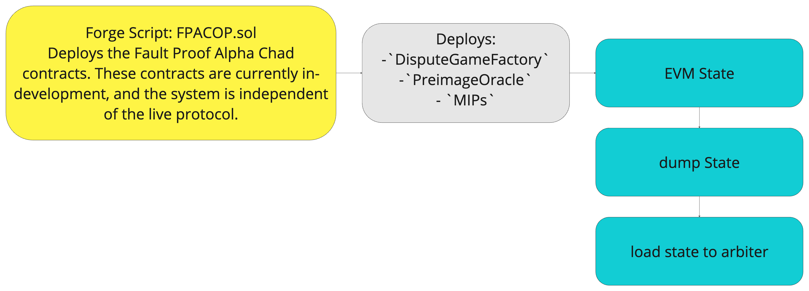
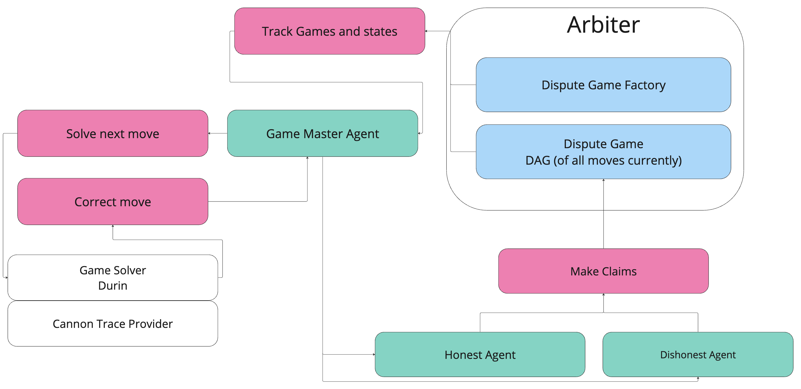

# Dispute Game Simulation Specifications

The goal of this document is to dial in on a speccifcation and scope for the Primitive team to audit the dispute game with Arbiter simulations. 

## Scope
We propose to define two core deliverables to the OP labs team. Both deliverables will evolve from this repository.
- A report of our findings and analysis of the dispute game located in the `security_report` directory.

- A simulation of the dispute game located in the `src` directory. The details of the simulation are defined below in the [Simulation Specification](#simulation-specification) section.

## The Dispute Game
The fault proof dispute game is an interactive proof system used to prove the validity of layer two state on layer one. The game is played by any number of players. The game has a 7 day chess clock and terminates when the clock runs out. Each player makes a move by making a `Claim` (see dispute game interface) about an index in an execution cannon execution trace. If no apposing move is made the claim implicitly resolves to true. Each player must post a bond to make a claim. If a player makes a claim that is false, and the game resolves then their bond is forfeit and payed to the player who made the apposing correct claim.

- [Dispute Game Interface](https://github.com/ethereum-optimism/specs/blob/main/specs/dispute-game-interface.md)
- [Fault Dispute Game](https://github.com/ethereum-optimism/specs/blob/main/specs/fault-dispute-game.md)

## Arbiter Simulation

Arbiter is an interface over an EVM sandbox built around the rust evm. Arbiter enables agent based simulations to model behavior of different externally owned accounts that would interact with a smart contract or system of smart contracts. This allow us to perturb different variables in the system and observe the effects on the system to discover potential attack vectors and anomalous behavior. 

### Simulation Specification
These are the details of the design of the simulation.

#### Initial State
The way we configure a simulation involves defining an initial state of the system that we want before itterating agent behavior over the model. Traditionally we have used deployer style agents to deploy the smart contracts we want to simulate with the right initial state. This has historically involved generating rust contract bindings and interfacing with contracts through these bindings.

It has come to our attention that many solidity developers deploy their infrastructure with forge scripts. We have been able to grab the state that initialized by a forge script on an anvil instance and dump it into a json file. This json file can then be loaded into the revm instance in arbiter to initialize the state of the system. The benifit of this is that we can initialize the state of the system the same way it would be initialized in production. This allows us to uncover any particular bugs that may be present in the forge script.



This work has already been done and the bash and forge scripts can we bee seen [here](state-dump/dump.sh) and [here](state-dump/monorepo/packages/contracts-bedrock/scripts/fpac/FPACOPS.sol)

The dispute game factory contract is self describing. The `PreImageOracle`

#### Agents

Agents are defined by their behaviors. We define a behavior trait as follows
```rust
/// The [`Behavior`] trait is the lowest level functionality that will be used
/// by a [`StateMachine`]. This constitutes what each state transition will do.
#[async_trait::async_trait]
pub trait Behavior<E>: Send + Sync + 'static {
    /// Used to bring the agent back up to date with the latest state of the
    /// world. This could be used if the world was stopped and later restarted.
    async fn sync(&mut self, _messager: Messager, _client: Arc<RevmMiddleware>) {}

    /// Used to start the agent.
    /// This is where the agent can engage in its specific start up activities
    /// that it can do given the current state of the world.
    async fn startup(&mut self) {}

    /// Used to process events.
    /// This is where the agent can engage in its specific processing
    /// of events that can lead to actions being taken.
    async fn process(&mut self, event: E) -> Option<MachineHalt>;
}
```

The dispute game simulation will have the following agents.

- **Game Master:** Responsible for reading the state of a dispute game instances (created by the dispute game factory contract), and sending the new claims to Durin, the dispute game solver, which will return a correct move. The Game master will then send the correct move to all other agents (game players) in the simulation. The game master is the only agent that is not a player in the game. The Game master is the most complicated agent in the simulation. It will be responsible for the following:
    - Reading the state of the dispute game instance
    - Sending the state to Durin
    - Receiving the correct move from Durin
    - Sending the correct move to all other agents

- **Honest Agent:** Responsible for making correct claims on the dispute game instance. This is the simplist agent in the simulation. It will be responsible for the following:
    - Recieving the correct move from the game master
    - Making a correct claim on a dispute game instance

- **Malicious Agent:** Responsible for making incorrect claims on the dispute game instance. This agent is also quite simple and can have many different variations. It will be responsible for the following:
    - Making an incorrect claim on a dispute game instance
    - Creating a game by submiting a dishonest cliam

Here is a diagram of the agent interactions in the simulation.



#### Durin

[Durin](https://github.com/anton-rs/durin) is a game solver that the game master will querry. Durin will solve a [cannon trace](https://github.com/ethereum-optimism/optimism/tree/develop/cannon) for the give claim and return the correct move.