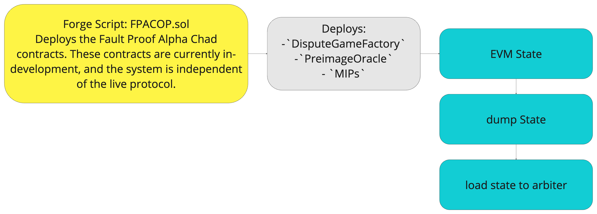
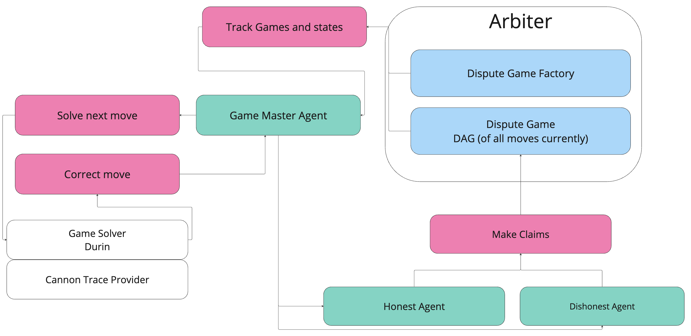
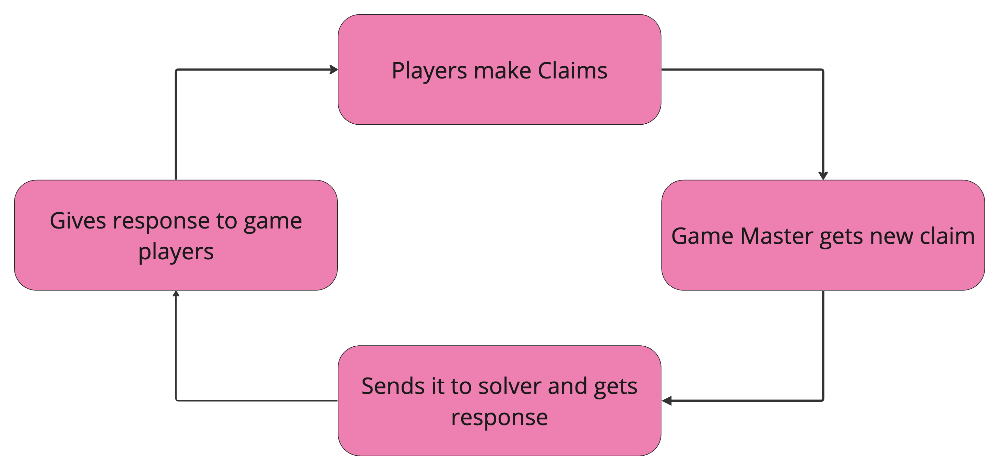

# Dispute Game Simulation Specifications

This document aims to dial in on a specification and scope for the Primitive team to audit the Dispute Game with Arbiter simulations. 
For the purpose of this document we consider a `Claim` to be a move in the Dispute Game.

## The Dispute Game
The fault-proof *dispute game is an interactive proof* system used to prove the validity of the layer two states on layer one. 
Fault proofs can be created by the dispute game for any Fault proof VM (FVM) and Fault Proof Program(FPP). 
We will be simulating the Op-Program with the cannon VM.
Any number of players can play the game. The game has a 7-day chess clock and terminates when the clock runs out.
Each player moves by making a `Claim` (see dispute game interface) about an index in a cannon execution trace. 
If no opposing move is made, the claim implicitly resolves to true. 
Each player must post a bond to make a claim. 
If a player makes a false claim and the game resolves, their bond is forfeited and paid to the player who made the opposing correct claim if one was made.

- [Dispute Game Interface](https://github.com/ethereum-optimism/specs/blob/main/specs/dispute-game-interface.md)
- [Fault Dispute Game](https://github.com/ethereum-optimism/specs/blob/main/specs/fault-dispute-game.md)

### The Path to Stage 2
We understand that the dispute game is a critical component of the path to stage 2 decentralization. 
We believe that the testing of the dispute game with Arbiter simulations is the most thorough way to study the security of the dispute game. 
We posit that the software of the simulation will be an invaluable asset to the Optimism Collective moving forward.
The ability to repoduce game simulations with different Fault VMs and Fault Proof Programs make it high leverage moving forward.  

## Scope
We propose to define two core deliverables for the OP Labs team. 
Both deliverables will evolve from this repository.
- A report of our findings and analysis of the Dispute Game located in the `security_report` directory. 
This is our scientific analysis of the securiy of the dispute game.

- A simulation of the dispute game located in the `src` directory. 
We want to run 100M Sims on a (single or many) connon trace (on average 1.5b instructions) with at least 5 agent behaviors. 
Each Cannon trace (which we can run as many simulations as we want on) takes about 45 minutes to solve.
The [Simulation Specification](#simulation-specification) section defines the simulation details below. 
This is a software artifact that can be used to reproduce the simulations of the Dispute Games.

## Arbiter Simulations

Arbiter is an interface over an EVM sandbox built around the rust evm. 
Arbiter enables agent-based simulations to model the behavior of different externally owned accounts that would interact with a smart contract or system of smart contracts. 
This allows us to perturb other variables in the system and observe the effects on the system to discover potential attack vectors and anomalous behavior. 

### Simulation Specification
These are the details of the simulation design.

#### Initial State
We configure a simulation by defining an initial state of the system we want before iterating agent behavior over the model. 
Traditionally, we have used deployer-style agents to deploy the smart contracts we want to simulate with the correct initial state. 
This has historically involved generating rust contract bindings and interfacing with contracts through these bindings.

Many solidity developers deploy their infrastructure with forge scripts. 
We have been able to grab the state that is initialized by a forge script on an anvil instance and dump it into a JSON file. 
This JSON file can then be loaded into an Arbiter instance to initialize the state of the system. 
The benefit of this is that we can initialize the system's state the same way it would be initialized in production. This allows us to uncover any particular bugs that may be present in the forge script. 
While this is convient with the optimism mono repo (many smart contracts), it does mean we will have to use the sol macro for communicating with the contracts (examples in the `src` directory. 



This work has already been done, and the bash and forge scripts can be seen [here](state-dump/dump.sh) and [here](state-dump/monorepo/packages/contracts-bedrock/scripts/fpac/FPACOPS.sol)

#### Involved Contracts
- `PreImageOracle`: It is my understanding that this is interacted with the solver and not our agents (need to check with Ben)
- `DisputeGameFactory`: This contract is used to create dispute game instances which enable the dispute game to be played. 
The game is played when players submit claims. 
A Claim is only submitted in opposition to the current state. 
- `MIPs`: MIPs is the mips32 instruction set architecture in solidity. 
This is what produces a cannon trace which is the state of L2 that players make claims about.

#### Agents

Agents are defined by their behaviors. 
We define a behavior trait as follows
```rust
/// The [`Behavior`] trait is the lowest-level functionality that will be used
/// by a [`StateMachine`]. This constitutes what each state transition will do.
#[async_trait::async_trait]
pub trait Behavior<E>: Send + Sync + 'static {
    /// Used to bring the agent back up to date with the latest state of the
    /// world. This could be used if the world was stopped and later restarted.
    async fn sync(&mut self, _messager: Messager, _client: Arc<RevmMiddleware>) {}

    /// Used to start the agent.
    /// This is where the agent can engage in its specific start-up activities
    /// that it can do, given the current state of the world.
    async fn startup(&mut self) {}

    /// Used to process events.
    /// This is where the agent can engage in its specific processing
    /// of events that can lead to actions being taken.
    async fn process(&mut self, event: E) -> Option<MachineHalt>;
}
```

The dispute game simulation will have the following agents.

- **Game Master:** Responsible for reading the state of a dispute game instance (created by the dispute game factory contract) and sending the new claims to Durin, the dispute game solver. 
Durin will return a correct move. The Game master will then send the correct move to all other agents (game players) in the simulation. 
The game master is the only agent who is not a player in the game. 
The Game master is the most complicated agent in the simulation. 
It will be responsible for the following:
    - Reading the state of the dispute game instance
    - Sending the state to Durin
    - Receiving the correct move from Durin
    - Sending the correct move to all other agents

- **Honest Agent:** Responsible for making correct claims on the dispute game instance. 
This is the most straightforward agent in the simulation. It will be responsible for the following:
    - Receiving the correct move from the game master
    - Making a correct claim on a dispute game instance

- **Malicious Agent:** Responsible for making incorrect claims on the dispute game instance. 
This agent is also quite simple but can have many different variations. It is perfectly sufficient for a malicious agent to make random incorrect claims. 
We should design up to five different malicious agent behaviors that make incorrect claims according to some huersitics. 
It will be responsible for the following:
    - Making an incorrect claim on a dispute game instance
    - Creating a game by submitting a dishonest claim

Here is a diagram of the agent interactions in the simulation.



#### Durin

[Durin](https://github.com/anton-rs/durin) is a game solver the master will querry. 
Durin will solve a [cannon trace](https://github.com/ethereum-optimism/optimism/tree/develop/cannon) for the given claim and return the correct move to the game master.
Druin solves the game by bisecting the cannon trace.

#### Main simulation loop
We have everything we need to run the main simulation loop with these agents and Durin. 
Once we get this iteration off the ground, we can start getting creative with malicious agent behavior and see the stress tests under which we can put the dispute game.


### Simulation Analysis

We consider a positive result **explicitly** to be a reproducible game that is resolved incorrectly for any reason (we correctly identified a flaw in the system). 
If we find a positive result we will investigate it further and identify and document the conditions under which it occurs in our report.
A positive result can give the Primitive Team more infromation about where to look for additional positive results in the system.
We consider a negative result **explicitly** to be no unexpected behavior in our simulations.

We will run 100M (rough estimate) game simulations on one or many cannon execiution traces. 
We will run these simulations to completion regardless of any findings we make along the way.
We will vary any combination of up to five malicious agents acording to agent heuristics. 

#### Agent Heuristics
- **Random:** This agent will make random incorrect claims.
- **Always:** This agent will make claims half the time and hoenst claims the other half of the time.
- **Game DDOS:** This agent will continously create games by submitting incorrect claims.
- **Purely Profit Seeking Honest Agent**: Plays the most profitable honest strategy.
- **Purely Profit Seeking**: Plays the most profitable strategy regardless of honesty.
- **Honest Agent**: Always Plays the honest strategy.

**Bonus**: Are there any agent hueristics regarding collusion and or censorship that we should consider? 
What combination of these agents are most important to consider?

A positive result would be a game in which the profit seeking agent is not abel to make a profitable honest claim.

#### Data Collection
- game ID: the ID of the dispute game instance
- Sequence of claims and their timesteps and transaction meta data: the sequence of claims made by the agents in the game cost of transactions and gas price.
- Wether the game was resolved correctly or not
- Agent meta-data: The cost of being malicious is the amount of money the malicious agent lost by being malicious.
- How many claims were made in a game: this is the number of claims made by all agents in the game.
- For Profit Seeking agents, what transactions do they consider sending? Honest, dishonest or nothing? and The Profit Value of each actions. 


We will perform analysis on the data we collect from the simulations.
We will graph the sequence of claims made over time and identify which agent the claim was made by.
We will compute averages and standard deviations for relevant data points to identify any key differences between games.

Given historical data, and distributions for gas price given the historical data.
We can then run simulations where we sample from these distributions to get a more realistic simulation of the gas price.
After 100M drawings from these distributions, we can draw some T-Stat conclusions about bond pricing: E.G Showing 99.99% confidence that if the network behaves as it has historically we dont believe there will be a vulnerability.

## Open questions
- What is the status of durin. 
Does it block us on anything? Should it be included in the scope?
- What are the externally owned accounts that interact with the pre-image oracle? 
- How much does OPLabs care about the Analysis Report vs the Simulation?
How important is the reproducability of the simulation? E.G we plug and play any fault proof VMs and any program trace. 